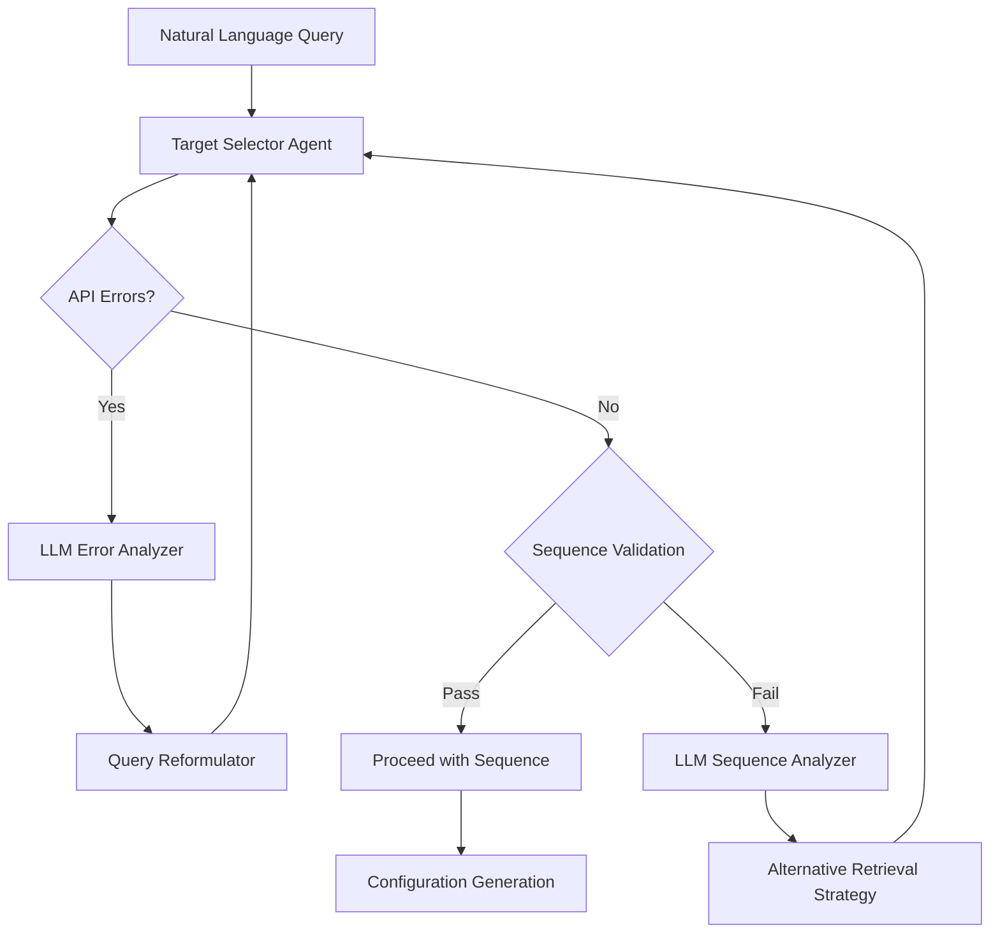

# Making the Target Selector Agent Agentic

## Overview

This enhancement will transform the Target Selector from a simple procedural component into an agentic system that can autonomously diagnose and resolve issues during protein target identification and sequence retrieval. The agent will leverage the LLM to make intelligent decisions, adapt to API changes, and ensure scientific accuracy.

## Goals

- Enable self-diagnosis and recovery from API errors
- Implement protein identity verification
- Create adaptive search strategies
- Ensure scientific validity of target sequences
- Reduce human intervention for common issues

## Architecture Changes



## Implementation Plan

### 1. LLM-Powered Error Handling

- **Error Analysis Component**
  - Create an `ErrorAnalyzer` class that processes API errors
  - Feed error messages to the LLM for diagnosis
  - Extract actionable insights from LLM's analysis

- **Query Reformulation**
  - Implement `QueryReformulator` class that generates alternative queries
  - Use LLM to transform failed queries into valid formats
  - Maintain a history of successful and failed query patterns

### 2. Protein Sequence Verification

- **Sequence Validator**
  - Create a `SequenceValidator` class to verify protein identity
  - Check known residues at key positions (e.g., G12 in KRAS)
  - Compare sequence length and key motifs with reference data

- **Reference Database**
  - Implement a lightweight reference DB for common cancer targets
  - Include minimal identifying information (key residues, length, motifs)
  - Allow for easy extension with new targets

### 3. Adaptive Search Strategy

- **Strategy Selector**
  - Implement a `SearchStrategySelector` class
  - Define a hierarchy of search strategies from specific to general
  - Use LLM to select appropriate strategy based on context

- **Multi-Stage Search Process**
  - Try direct accession lookup for known proteins
  - Fall back to gene name + organism search
  - Use keyword search with post-retrieval filtering as last resort

### 4. Integration with UniProt Client

- **Enhanced UniProt Client**
  - Extend current client with error handling callbacks
  - Implement retry mechanism with different query formats
  - Add validation hooks for retrieved sequences

- **API Format Learning**
  - Record successful API formats for future use
  - Update preferred formats based on success/failure rates
  - Periodically verify format validity

## Code Components

```python
# New components to be added

class ErrorAnalyzer:
    """Analyzes API errors using LLM to determine cause and solution."""
    
    def analyze(self, error_message: str) -> Dict[str, Any]:
        """
        Analyze error message and return diagnosis and suggested fixes.
        
        Args:
            error_message: The error message from the API
            
        Returns:
            Dictionary containing diagnosis and suggested fixes
        """
        # Implementation will use LLM to analyze the error

class QueryReformulator:
    """Reformulates failed queries into potentially valid formats."""
    
    def reformulate(self, original_query: Dict[str, Any], error_analysis: Dict[str, Any]) -> List[Dict[str, Any]]:
        """
        Generate alternative query formats based on error analysis.
        
        Args:
            original_query: The original failed query
            error_analysis: Analysis from ErrorAnalyzer
            
        Returns:
            List of alternative query formats to try
        """
        # Implementation will use LLM to generate alternatives

class SequenceValidator:
    """Validates protein sequences for scientific accuracy."""
    
    def validate(self, protein_name: str, sequence: str) -> Tuple[bool, str]:
        """
        Validate if a sequence matches expected properties of the named protein.
        
        Args:
            protein_name: Name of the protein
            sequence: Protein sequence to validate
            
        Returns:
            Tuple of (is_valid, reason)
        """
        # Implementation will check against reference data

class SearchStrategySelector:
    """Selects appropriate search strategy based on context and history."""
    
    def select_strategy(self, protein_target: Dict[str, Any], previous_attempts: List[Dict[str, Any]]) -> Dict[str, Any]:
        """
        Select search strategy based on target and previous attempts.
        
        Args:
            protein_target: Target protein information
            previous_attempts: Record of previous search attempts
            
        Returns:
            Search strategy configuration
        """
        # Implementation will use LLM to select strategy
```

## Extension to Current Target Selector

```python
# Enhanced fetch_protein_sequence method

def fetch_protein_sequence(self, target_info: Dict[str, Any]) -> Optional[Dict[str, Any]]:
    """
    Fetch protein sequence information from UniProt with agentic error recovery.
    
    Args:
        target_info: Dictionary containing target protein information.
        
    Returns:
        Dictionary with sequence information or None if not found.
    """
    target_name = target_info.get("name")
    if not target_name:
        self.logger.warning("Target name not provided")
        return None
        
    self.logger.info("Fetching sequence for %s", target_name)
    
    # Initialize components
    error_analyzer = ErrorAnalyzer()
    query_reformulator = QueryReformulator()
    sequence_validator = SequenceValidator()
    strategy_selector = SearchStrategySelector()
    
    # Track search attempts
    search_attempts = []
    max_attempts = 5
    
    # Initial search strategy
    current_strategy = {
        "method": "gene_name",
        "organism": target_info.get("organism"),
        "parameters": {}
    }
    
    # Attempt retrieval with automatic recovery
    for attempt in range(max_attempts):
        try:
            # Apply current strategy
            if current_strategy["method"] == "gene_name":
                protein = self.uniprot_client.get_protein_by_gene_name(
                    target_name, current_strategy.get("organism")
                )
            elif current_strategy["method"] == "search":
                search_query = current_strategy.get("query", target_name)
                search_results = self.uniprot_client.search_protein(
                    search_query, limit=current_strategy.get("limit", 1)
                )
                protein = search_results[0] if search_results else None
            elif current_strategy["method"] == "accession":
                protein = self.uniprot_client.get_protein_by_accession(
                    current_strategy.get("accession")
                )
            else:
                protein = None
                
            # Record attempt
            search_attempts.append({
                "strategy": current_strategy,
                "success": protein is not None,
                "error": None
            })
            
            # If found, validate sequence
            if protein:
                accession = protein.get("primaryAccession")
                sequence = protein.get("sequence", {}).get("value")
                
                if not sequence:
                    self.logger.warning("Sequence not found for %s", target_name)
                    continue
                
                # Validate sequence
                is_valid, reason = sequence_validator.validate(target_name, sequence)
                
                if is_valid:
                    # Process mutations and return result
                    # (existing mutation processing code)
                    return sequence_info
                else:
                    self.logger.warning("Invalid sequence: %s", reason)
                    # Record validation failure
                    search_attempts[-1]["validation_error"] = reason
            
            # If we reach here, we need a new strategy
            current_strategy = strategy_selector.select_strategy(
                target_info, search_attempts
            )
            
        except Exception as e:
            # Handle error
            error_message = str(e)
            self.logger.error("Error during search: %s", error_message)
            
            # Record error
            search_attempts.append({
                "strategy": current_strategy,
                "success": False,
                "error": error_message
            })
            
            # Analyze error
            error_analysis = error_analyzer.analyze(error_message)
            
            # Generate new strategies
            alternative_strategies = query_reformulator.reformulate(
                current_strategy, error_analysis
            )
            
            if alternative_strategies:
                current_strategy = alternative_strategies[0]
            else:
                # Fall back to simple search if no alternatives
                current_strategy = {
                    "method": "search",
                    "query": target_name,
                    "limit": 5
                }
    
    # If all attempts fail, return None
    self.logger.warning("Failed to find valid sequence for %s after %d attempts", 
                       target_name, max_attempts)
    return None
```

## LLM Integration Points

1. **Error Analysis**: Using LLM to interpret API error messages and suggest fixes
2. **Query Reformulation**: LLM generates alternative query formats
3. **Sequence Validation**: LLM assesses if a sequence matches expected protein properties
4. **Strategy Selection**: LLM chooses search strategy based on context and history

## Training and Adaptation

- Record successful and failed interactions for continual improvement
- Periodically update reference data based on successful retrievals
- Use retrieved metadata to enhance validation criteria

## Expected Benefits

- **Resilience**: Robust handling of API changes and errors
- **Accuracy**: Higher confidence in protein identity and sequence correctness
- **Efficiency**: Reduced need for manual intervention
- **Learning**: System improves over time with more interactions

## Implementation Phases

1. **Phase 1**: Basic error handling and query reformulation
2. **Phase 2**: Sequence validation and reference database
3. **Phase 3**: Advanced search strategies and learning mechanisms
4. **Phase 4**: Full agentic behavior with minimal supervision

This enhancement will transform the Target Selector into a truly agentic component that can handle complex situations and ensure scientific validity through intelligent decision-making and adaptation.
